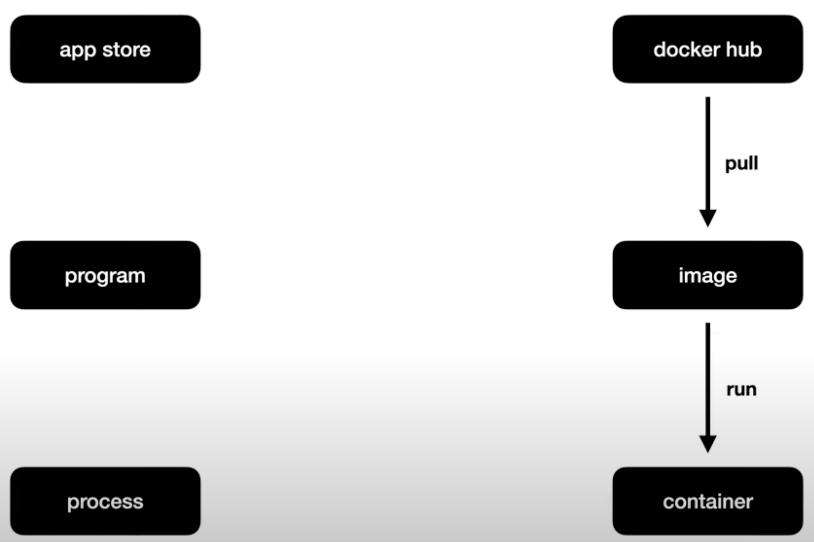
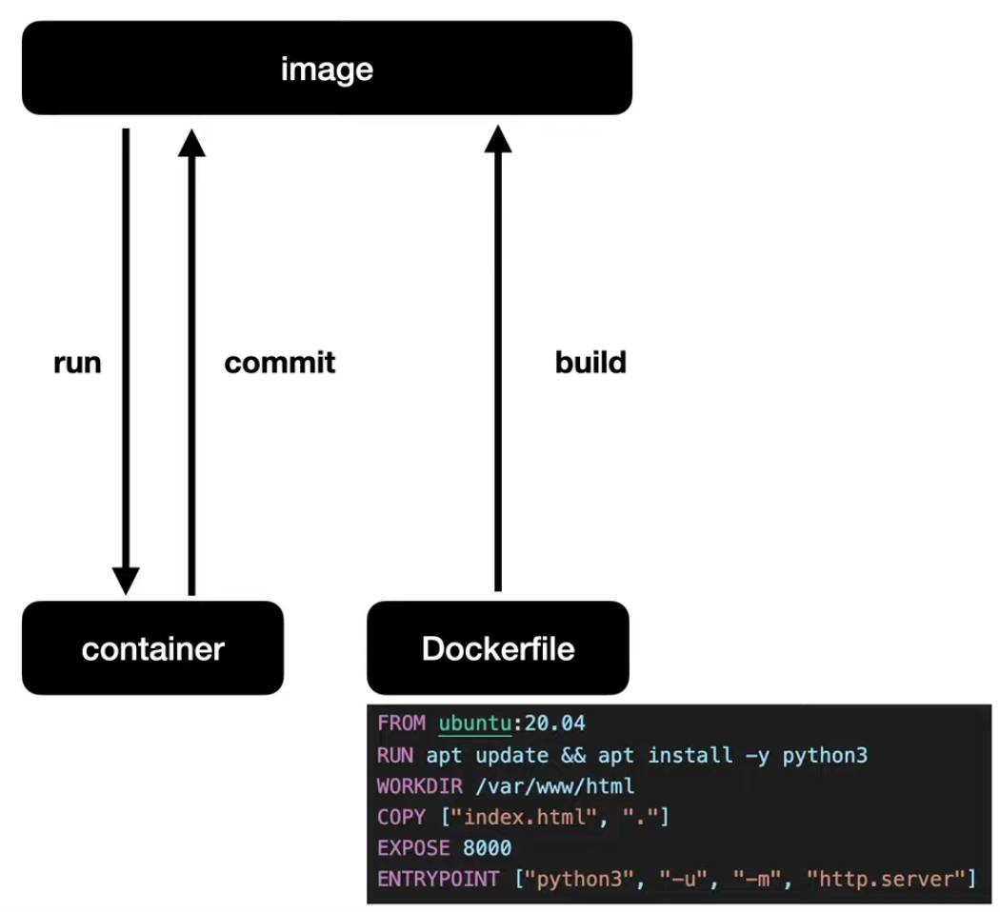

# Docker

> Docker hub --'docker pull'--> Docker Image --'docker run'--> Docker Container


**Host (내 컴퓨터) 안에 Container를 만들어서 운영한다.**

[Docker Manual](https://docs.docker.com/engine/reference)

<br>

---
## Part 1. Docker Basics
<br>

### 1. Image Pull
- [dockerhub 사이트](https://hub.docker.com/search?q=) 에서 원하는 이미지 선택하여 pull 하기<br>
ex) `> docker pull httpd`

- To see existing images
    - `> docker images`

- To remove a image
    - `> docker rmi [image_name]`

---
### 2. Container Run
- To run (create) a container
    - `> docker run [image_name]`
- To run a container with name
    - `> docker run --name [image_name] [container_name you want]`

- To see a running container
    - `> docker ps`

- To stop a running container
    - `> docker stop`

- To start a not-running container
    - `> docker start [container_name]`

- To see logs of a container
    - `> docker logs [container_name]`

- To remove a stopped or not-running container
    - `> docker rm [container_name]`

---
### 3. Connect Container and Host (Local) 'Network'
- To connect container port with host port
    - `> docker run --name [container_name you want] -p [Host Port]:[Container Port] [Image_name]`
    - 외부에서 `localhost:[Host Port]/[File]` 로 접속시, Host의 Port로 접속한뒤, 연결된 Container의 Port로 접속하여 원하는 파일 위치로 도달하게 된다.(=포트포워딩)

---
### 4. Execute a (running) Container
- To run a command line (CLI) of a container
    - `> docker exec -it [container_name] /bin/bash` (more useful)
    - or `> docker exec -it [container_name] /bin/sh`

- To end the command line
    - `# exit`

---
### 5. Connect Container and Host 'File System'
- To connect container file system and host file system
    - `> docker run -p [Host Port]:[Container Port] -v [Host File Directory]:[Container File Directory]`
    - 호스트와 컨테이너의 파일 시스템을 연결시키면, 호스트에서 파일을 수정하면 그 내용이 컨테이너의 파일에도 적용된다.

<br>

---
## Part 2. Make Image

- commit vs build
    - -> 둘 다 이미지를 만든다.
    - commit : 백업
    - build : 생성 가이드

### 1. Commit (Container)
- To commit a container to a image
    - `> docker commit [container_name(source)] [image_name(destination)]`
- To check images
    - `> docker images`

---
### 2. Build (Dockerfile)
[dockerfile ref](https://docs.docker.com/engine/reference/builder/)
- To build a dockerfile to a image -> make a file named 'Dockerfile'
    - `> docker build [path or URL]`
    <br>ex) docker build .

    - `> docker build -t [image name]` : build image with name
    <br>ex) docker build -t web-server-image .
- How to write 'dockerfile'
    - `FROM [image_name]` : specify which image to use (parent image)
    - `RUN [command1] && [command2] && ..` : serially execute a command (must write commands "IN ORDER"!)
        - 사용자의 입력을 받는 커맨드 (ex. Y or N) 가 있으면 작동하지 않으므로, '-y' 옵션을 같이 줘야할 수도 있다.
    - `WORKDIR [directory or path]` : move or create&move to a directory
    - `COPY [source path or file] [destination path]` : copy a file from source to destination
    - `CMD ["[executable]" "[param1]" "[param2]" ...]` : execute command (with options if you want)
    <br><br>
    ※ RUN vs CMD
        - RUN is used on 'build' level
        - CMD is used on 'execution' level

    <br>
```
ex) 
FROM ubuntu:20.04
RUN apt update && apt install -y python3
WORKDIR /var/www/html
COPY index.html .
CMD ["python3", "-u", "-m", "http.server"]
```

<br>

---
## Part 3. Push to Docker Hub

1. Sign up to [Docker Hub](https://hub.docker.com/)
2. Make a repository
3. (From CLI) Push docker image to docker hub
    - `> docker push [image name]`
        - you will have to <b>login</b> to docker hub from cli
<br>

---
## Part 4. Docker Compose
[생활코딩 Youtube 강의](https://www.youtube.com/watch?v=EK6iYRCIjYs)

### Docker Compose
- Running, Serializing, Managing related containers to create a service
- Runs all container at once by running a docker compose file
1. Pull related images (or make related dockerfiles and make it to images)
2. Make a compose file : make <b>"docker-compose.yml"</b> file
3. `docker-compose up` : run docker containers as follows (as constructed in docker-compose.yml file)
4. `docker-compose down` : stop docker containers